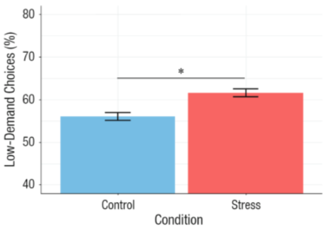

<!-- Reproducibility reports should all use this template to standardize reporting across projects. These reports will be public supplementary materials that accompany the summary report(s) of the aggregate results. -->

## Introduction

In this current research article, Bogdanov, et al. (2021) explores and compares paradigms on how acute stress impairs central executive-dependent cognitive control processes. Utilizing physiological and subjective measures and demand-selection at differentiating levels, cognitive-effort avoidance was assessed as more effortful and verily decreases motivation when switching between tasks. Cognitive performance defined as a combination of two factors: 1) processing ability, and 2) the decision on how much cognitive effort people want to expend. A cost-benefit analysis is involved in the latter decision-making, comparing how demanding a task would be for top-down processes versus the anticipated benefits for acting on a task. 

In a 2-day crossover within-subject study, the Bogdanov and colleagues tested if acute psychosocial stress would diminish participant motivation to use cognitive effort, and their preference for lower-demanding tasks. This is important as it offers insight on how stress, rather than cognitive ability, can shape behavior to reduce engagement in effortful performances. Instead, stress can influence and shape behaviors by modulating people's motivation to expend cognitive control.

In an effort to promote open science and accessibility, I have completed a reproducibility study by Bogdanov, et al. (2021). I hope to provide confirming evidence that their participants preferred less demanding behavior when under acute psychosocial stress and completing task-switching performances. 

**Clarify key analysis of interest here**  

In this original study, the key analyses to confirm is the Trier Social Stress Test (TSST) was successful in inducing acute stress through subjective and physiological responses. The stress responses were measured using participant subjective ratings and salivary cortisol concentrations, respectively. For the reproducibility study, I completed the t-tests on participant ratings of difficulty, unpleasantness, and stressfulness of the TSST task to validate if the stress condition was significantly induced stress compared to the control condition. The key analysis for the Demand-Selection Task (DST) will be a reproduction of Figure 3A. This figure displays the percentage participants that chose the low-demanding task in each condition.


### Justification for choice of study

My current research interests include early life stress and childhood adversity, and how both affect cognition as well as biological markers. I am interested in this study since it includes physiological and psychological measures to generate a comprehensive assessment of the cognitive-control paradigm for stress. I also plan to use the Trier Social Stress Test in my own research study for my first-year project. Learning more about manipulating these types of measure will equip me with computational tools needed for my area of interest.

### Anticipated challenges

I am not familiar with R and this is my first time utilizing it extensively on a project. I anticipate this project will be a great practice for learning statistical analyses like the t-test and how to create graphs and clean datasets. I may also run into a challenge with analysis of the physiological measures since I have no previous training. The original paper provided open data for me to access, but the code was not available so it may also be challenging to compute on my own in order to reproduce the same results. 

### Links

Project repository (on Github): https://github.com/psych251/bogdanov_2021.git

Original paper (as hosted in your repo): https://github.com/psych251/bogdanov_2021/blob/main/original_paper.pdf

## Methods

### Description of the steps required to reproduce the results

1.	Identify open data from study in OSF (https://osf.io/26w4u/)
2.	Clean two data sets in R using the appropriate code 
3.	Complete key analyses
4.	Reproduce the tables and figures from original article including within-group differences for low- vs high-demand selection
5.	Compare results with original article 

### Differences from original study

Although the data is openly available for the original study, the coding script is not so there may be variance in the statistical outcome based on my own code. The original study used R version 3.6.2, while I am using R version 4.2.2.

## Project Progress Check 1

### Measure of success and pipeline progress

Please describe the outcome measure for the success or failure of your reproduction and how this outcome will be computed.

There were two datasets available: one with demographic and TSST data, and the second with the Demand-Task Selection data. The outcome measures for the first stress induction hypotheses are t-tests. There are physiological and subjective stress measures available (i.e., cortisol levels from saliva samples, blood pressure, and participant ratings evaluating subjective stress experience). I chose to reproduce the t-tests for the subjective ratings parameters, comparing if the stress condition was more difficult, more unpleasant, and more stressful than the stress condition.  All subjects had to complete both the stress and control conditions based on day they completed each test (Day 1 vs. Day 2). Right now, I am still preprocessing the data. 

The outcome measure for the second demand-selection task will be reproducing Figure 3A from Bogdanov et al. (2021). I am currently working on the first hypothesis.

## Results

### Data preparation

Data preparation following the analysis plan.
	
```{r}
##FOR THE TIER SOCIAL STRESS TEST HYPOTHESIS
#### Load Relevant Libraries and Functions
library(tidyverse)
library(ggplot2)
library(readr)
library(dplyr)
library(scales)

#### Import data
DST_demographics_osf_org <- read.csv("DST_demographics_osf_org.csv", header = T, na.strings ="")
bogdanov <- DST_demographics_osf_org
View(bogdanov)
colnames(bogdanov) #to see column names 

#### Data exclusion / filtering
bogdanovtidy <- bogdanov[-c(1,5:89,97:102)] #to remove unnecessary columns and keep the subjective stress ratings
View(bogdanovtidy)

str(bogdanovtidy[,c(1:10)]) #to check if .CSV data has been read as integers or characters (aka N/A)


#### Prepare data for analysis - create columns etc.

bogdanovtidy$TSST_difficult_control <- as.numeric(as.factor(bogdanovtidy$TSST_difficult_control)) #to change variables in number values
bogdanovtidy$TSST_unpleasant_control <- as.numeric(as.factor(bogdanovtidy$TSST_unpleasant_control))
bogdanovtidy$TSST_stressful_control <- as.numeric(as.factor(bogdanovtidy$TSST_stressful_control))

```

```{r}
##FOR THE DEMAND SELECTION TASK HYPOTHESIS
#### Load Relevant Libraries and Functions
library(tidyverse)
library(ggplot2)
library(readr)
library(dplyr)
library(scales)

#### Import data

DST_data_osf2 <- read.csv("DST_data_osf2.csv", header = T)
DST_data <- DST_data_osf2
View(DST_data)
colnames(DST_data) #to see column names 

#### Data exclusion / filtering

str(DST_data[,c(1:10)]) #to check if .CSV data has been read as boolean (True/False), intergers or characters 

#### Prepare data for analysis - create columns etc.

## Low-demand data percentages between stress and control conditions
DSTeffort <- DST_data |>
  group_by(condition,effort_choice) |> 
 summarize(cnt = n()) |>
  mutate(freq = round(cnt / sum(cnt), 3)*100) |> #to create new column with changed rates into percentages
  mutate(percentage = freq) #create new column called percentages 
DSTeffort

DSTeffort2 <- DSTeffort[-c(4)] #remove freq column

LowDemandDST <- DSTeffort2 |> 
  filter(effort_choice == 1) #only include low-demand choices ("1")

LowDemandDST

```


### Key analysis

The key analyses will be t-tests for subjective ratings of the Trier Social Stress Test. This will confirm if the TSST signficantly induced stress in the participants.
```{r}
#T-Test for TSST subjective difficulty ratings

ttest_DIFF <- t.test(bogdanovtidy$TSST_difficult_stress, bogdanovtidy$TSST_difficult_control, paired=TRUE,
       data = bogdanovtidy,
       var.equal = TRUE,
       na.action = na.omit)
ttest_DIFF

#T-Test for TSST subjective unpleasantness ratings

ttest_UNPLE <- t.test(bogdanovtidy$TSST_unpleasant_stress, bogdanovtidy$TSST_unpleasant_control, paired=TRUE,
       data = bogdanovtidy,
       var.equal = TRUE,
       na.action = na.omit)
ttest_UNPLE

#T-Test for TSST subjective stressfulness ratings

ttest_STRESS <- t.test(bogdanovtidy$TSST_stressful_stress, bogdanovtidy$TSST_stressful_control, paired=TRUE,
       data = bogdanovtidy,
       var.equal = TRUE,
       na.action = na.omit)

ttest_STRESS
```

The second analysis compares the percentage of participants in both conditions who made low-demand choices in the Demand-Selection Task. Although not included in the original paper, below is a table with the percentages for both high- and low-demand choices across trials for comparison. The high-demanding choices are indicated by "0" and the low-demanding choices are "1".

```{r}
DSTeffort
```

This is Figure 3A from the original paper by Bogdanov et al. (2021). The figure displays the percentages of participants' low-demand choices in both stress and control conditions

```{r}
library(knitr)
 #to insert image from original paper
```

\textfloatsep
This is a reproduction of Figure 3A.
```{r}
##Reproduced bar graph for Figure 3: low-demand choices in both stress and control conditions
ggpLD <- ggplot(data = LowDemandDST, aes(x=condition, y = percentage, fill=condition)) +
  geom_bar(stat = "identity")+
  coord_cartesian(ylim=c(40,80)) + #to set y-axis limits
  scale_y_continuous(breaks= (seq(40,80, by = 10))) + #to add breaks within y-axis by increments of 10
 labs(x="Condition", y="Low-Demand Choices (%)", title = "Percentage of Low-Demand Choices Across Trials") + #to update main labels
  theme(plot.title = element_text(hjust = 0.5), legend.position = "none") + #to adjust title spacing
  scale_x_discrete(labels = c("Control", "Stress")) #to add smaller x-axis labels  for conditions
ggpLD
```

###Exploratory analyses

Any follow-up analyses desired (not required).  

## Discussion

### Summary of Reproduction Attempt

Two different tasks were used in the original study in order to evaluate acute psychosocial stress and cognitive effort avoidance. First, the TSST tested stress induction. The primary results were t-tests to confirm whether participants would subjectively rate the stress condition as more difficult (t(38) = 7.86, p <00.1), more unpleasant (t(38) = 8.26, p < 00.1), and more stressful (t(38) = 9.17, p < 00.1) than the control condition. I failed to reproduce the first key result: more more difficult (t(39) = 17.409, p <00.1), more unpleasant (t(39) = 16.675, p < 00.1), and more stressful (t(39) = 18.311, p < 00.1).

The second key result was reproducing Figure 3A which showed the percentages of participant who selected low-demand choices in the Demand-Selection Task compared by condition. I successfully reproduced this key result.The stress condition bars in both graphs predicted that acute psychosocial stress significantly increased the participant's preference for low-demanding choices, or cognitive effort avoidance.

### Commentary
Overall, this was a partially successful reproduction study. Although unable to reproduce the TSST paired t-tests correctly, the results p-values still showed that TSST was able to significantly induce stress based on subjective participant responses. The t-statistic for each test came out doubled and may not have accounted  for the sample being within-subject. Also note that 2 subjects were removed in the original study after analysis was completed based on their DST reaction times being too close to chance level. I was unable to identify which two participants to exclude from 300 trials per condition. This possibly affected the t-statisitc outcomes as well.
Figure 3A was successfully reproduced showing the impact of acute psychosocial stress increasing participant preference for cognitive avoidance behavior. This result gives insight on how stress can shape choices and behavior by modifying people's motivation in order to expend cognitive control. 

